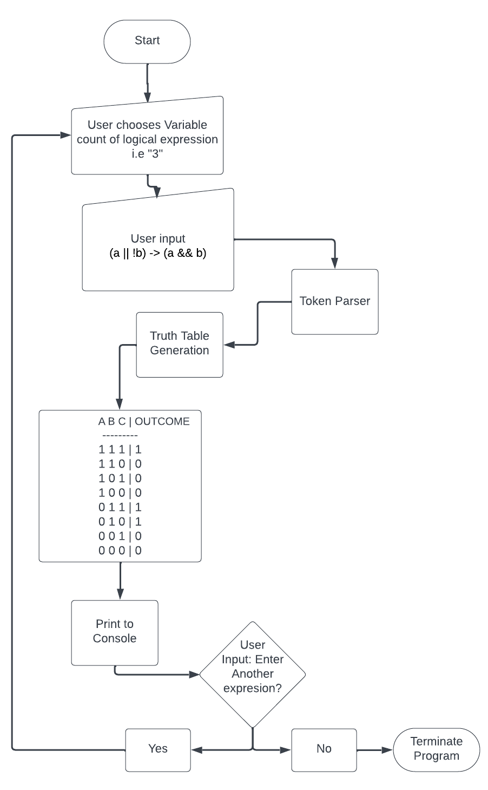
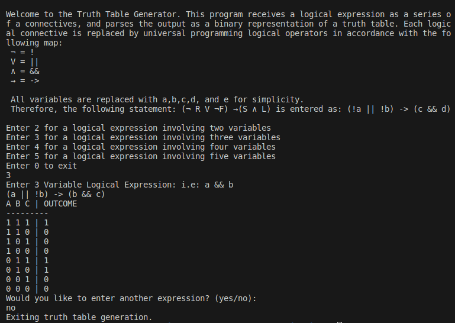
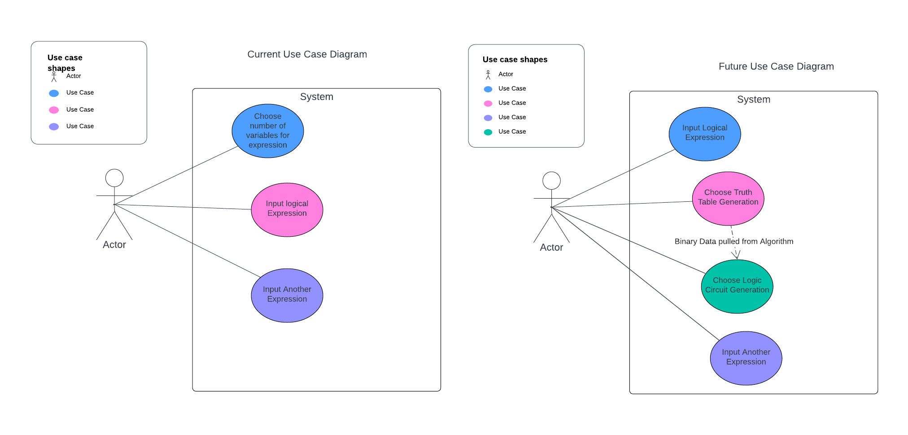
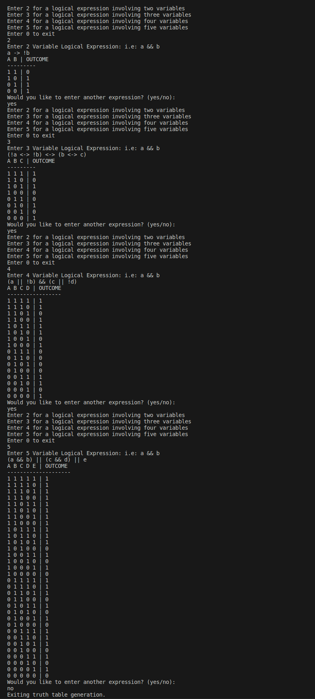

# Truth Table Calculator

## Introduction
The Truth Table Calculator is a program designed to compute and graphically present truth tables derived from user-specified logical propositions. This program affords users the opportunity to explore how logical connectives play a crucial role in propositional logic.

## Background
Logical connectives are operators that amalgamate or modify logical statements in the form of propositions. Propositional representation of logical connectives provides representation of relationships. These expressions play an extremely important role in analytical reasoning. Truth tables are essential tools in visualizing and resolving logical dilemmas, engaging in Boolean algebra, assessing logical equivalence, and facilitating decision-making processes. Boolean operations are behind many everyday functionalities, including search engine queries.

## Program Description
Users input a sequence of logical connectives and the program renders these inputs as truth tables. User input is parsed into a variety of algorithms that parse and iterate over characters, variables, and constants to produce a truth table.

## Primary Programmatic Approach
The code leverages C and C++ libraries. All interaction takes place within the system terminal. Truth table results are displayed in binary format.

## High-Level Programmatic Approach and Design: 
 **Displayed in Figure 1** 
1. **User Input Management:**
    - The application accepts logical expressions comprising variables labeled as a, b, c, d, and e.
    - Connectives are denoted using symbols like "||" for "∨" (or), "&&" for "∧" (and), and "!" for "¬" (not).
    - User selects the number of characters their logical expression will contain (up to 5)
    - User inputs logical expression adhering to program parameters
2. **Logic Gate Parsing:**
    - The application processes user-provided logical expressions to produce the selected truth table graphical representation.
3. **Truth Table Generation:**
    - Leveraging a modified version of the shunting algorithm, the program parses logical operators into tokens and characters.
    - It evaluates each row sequentially, storing results in a map and ultimately displaying them in a binary format as illustrated in Figure 1.

## 

**Figure 1**

## Example:
**Displayed in Figure 2** 

Figure 2 displays an example of a user interaction within the program. First, the program provides instruction to the user explaining how the program works. The user is prompted to input the number of characters their selected logical expression contains. The user selects “3” – denoting a three variable expression. Next, the program instructs the user to input their expression. The user inputs “(a || !b) → (a && b)”. Finally, the program performs the required calculations, displays the truth table as a binary representation, and asks the user if they wish to make another instruction.
 
 
**Figure 2**
 
## Use Case Diagram:
**Displayed in Figure 3** 

Figure 3 represents the current use case diagram. The leftmost image represents the current use case: The user may choose the number of variables they wish to enter as a logical expression. They may input the logical expression and finally, choose to input another logical expression.

The rightmost image represents the potential use case following program improvements. Future versions of the program will allow the user to engage the program to compute logic circuits and display them as a graphical representation.

**Figure 3**

## Running Code:
**Displayed in Figure 4** 

Figure 4 depicts a screenshot of the program compiling and running.
 
 
**Figure 4**
